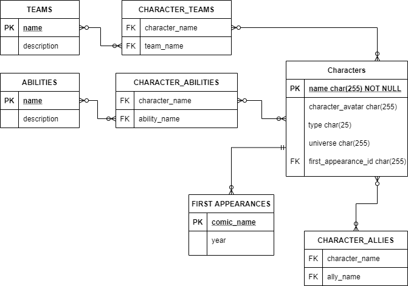

# REST / GraphQL APIs

The current project is developed in Java using Spring, and aims to create a GraphQL API based on a REST API without losing functionality.

The data to use is related to DC and Marvel characters (a very small subset) and the database schema is as follows (all attributes are strings):

**NOTE**: To correctly run this project, **first** run the REST API one bacause that's the one that creates all the necessary data. The GraphQL project connects to the H2 database created by the first one.

    

At high level, the project package structure is:
* **commons**: contains enums, models, repositories and services to access DB data that are common to both APIs
* **graphql**: will contain all the classes related to the GraphQL API 
* **rest**: contains models and resources that make up the REST API

And the resources of the project are:
* **application.propertes**: contains all the properties of the project. **Note**: The default port is 7070
* **data.sql**: contains data set to be loaded **everytime** the project starts
* **/graphql/schema.graphqls**: GraphQL schema to use to define the GraphQL API
* **/postman/api_characters.json**: Contains a Postam collection to use the REST API defined in the project

The REST API was just created to be a basis for the GraphQL API. In this way, **by no means tries to be a fully working API, and a lot of use cases might not be available/developed**. Having said that, the endpoints available are:

`GET` /abilities: returns all abilities existing in the system

`GET` /firstAppearances: returns all first appearances existing in the system

`GET` /teams: returns all teams existing in the system

`GET` /characters: returns all characters existing in the system, and allows the use of some parameters (all are optional):

`universe=[DC|MARVEL]`: allows to filter by character's universe 
`sortBy=[string]`: column name to sort results by. By default, the system will sort by character's name 
`order=[ASC|DESC]`: order in which the sorted result will be returned. By default, an ASC order is taken 
`limit=[integer]`: amount of results to return 
`offset=[integer]`: indicates the first result to be taken into account 

`POST` /characters: allows the creation of a new character

`GET` /characters/id: returns the character whose name matches with **id**, if any, and returns the character

`PUT` /characters/id: allows the edition of the character whose name matches **id**, if any, and returns the character

`DELETE` /characters/id: deletes the character whose name matches **id**, if any, and returns the id if the operation was successfull

**NOTE**: When the project starts, some extra URIs are available (besides the ones listed above because of the REST API):

`/graphql` is the endpoint where the GraphQL API will be published

`/playground` is the client we'll use to make query/mutations request to the server using the GraphQL API

# Branches

`main` contains all the basics to start the workshop

`graphql-full-solution` contains the full solution to the workshop